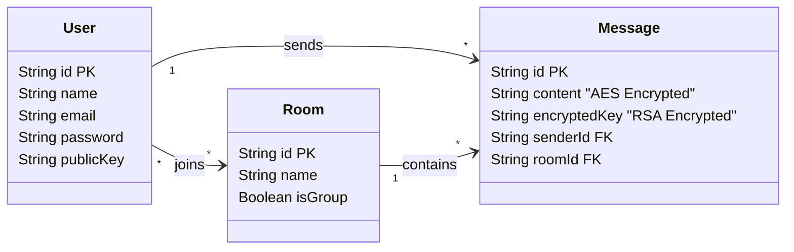
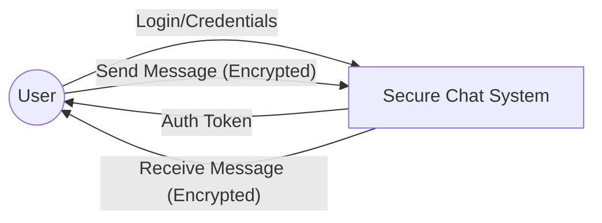
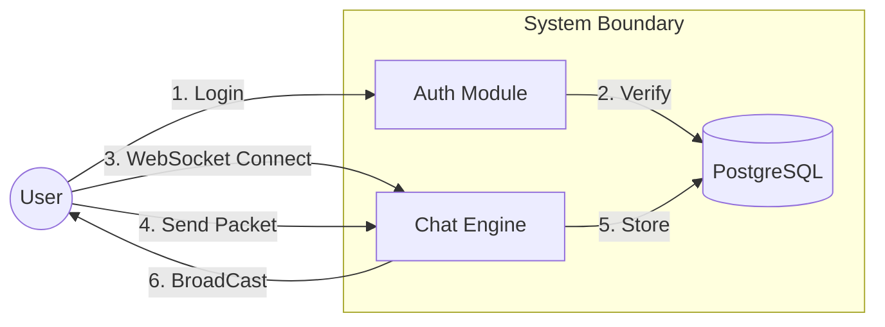
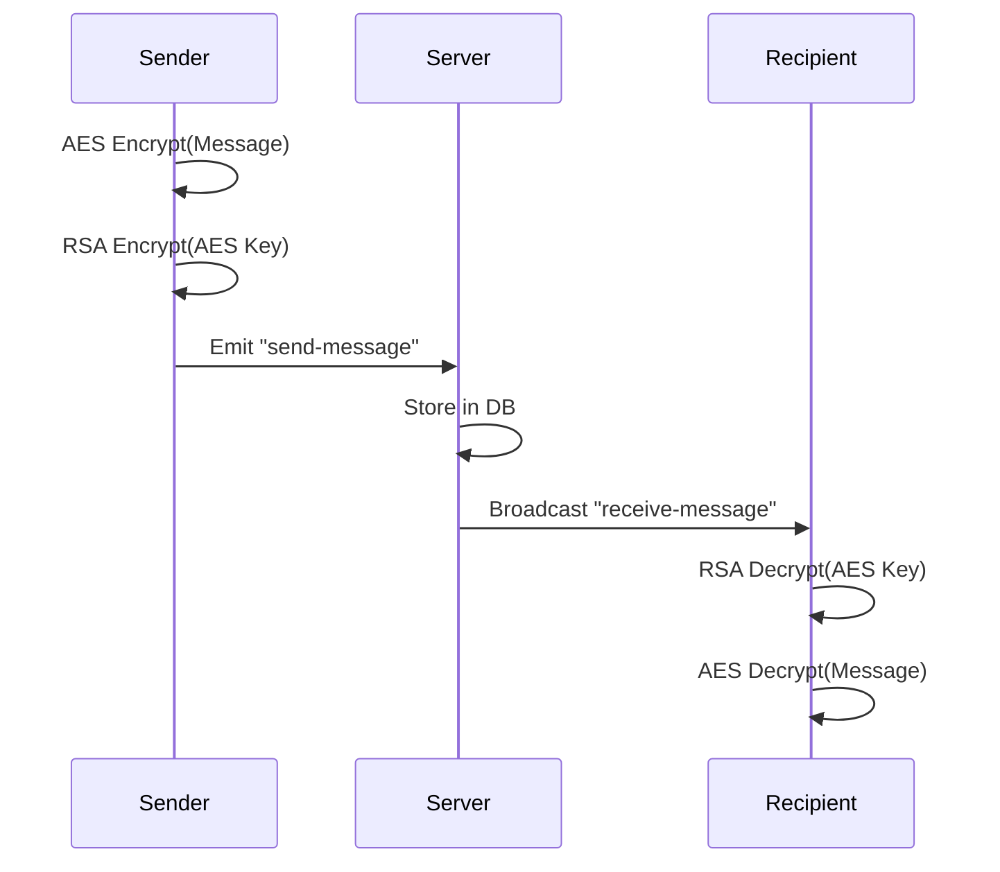

# PROJECT REPORT

# SECURE REAL-TIME CHAT APPLICATION

**A DISSERTATION SUBMITTED IN PARTIAL FULFILLMENT OF THE REQUIREMENTS FOR THE DEGREE OF BACHELOR OF TECHNOLOGY**

---

## ABSTRACT

In the contemporary digital landscape, real-time communication has become the backbone of personal and professional interaction. However, the ubiquity of instant messaging platforms has raised significant concerns regarding data privacy, security, and user sovereignty. Conventional messaging applications often rely on centralized architectures where messages are stored in plaintext or reversibly encrypted formats accessible to service providers, creating vulnerabilities to data breaches, mass surveillance, and unauthorized data mining.

This project, titled **"Secure Real-Time Chat Application,"** aims to address these critical issues by developing a robust, web-based communication platform that guarantees absolute privacy through **End-to-End Encryption (E2EE)**. Unlike standard implementations, this system ensures that cryptographic keys generated for message decryption are stored exclusively on the client-side, rendering the message content mathematically inaccessible to the server and any third-party interceptors.

The application is engineered using a modern, scalable technology stack. The frontend is built on **Next.js**, ensuring a responsive and performant user interface, while the backend utilizes **Node.js** and **Express**, integrated with **Socket.IO** to facilitate low-latency, bi-directional, event-driven communication. Data persistence is managed via **PostgreSQL** and **Prisma ORM**, storing only encrypted blobs and metadata.

This report documents the entire software development life cycle of the project, from the initial requirement analysis and theoretical formulation of the cryptographic protocol (Hybrid RSA-2048/AES-256) to the system design, implementation details, and final performance testing. The results demonstrate a highly secure, user-friendly, and efficient messaging solution that successfully mitigates the risks associated with centralized data storage while maintaining the speed and utility expected of modern chat applications.

---

## TABLE OF CONTENTS

**1. INTRODUCTION**

- 1.1 Secure Real-Time Chat System - Overview
- 1.2 Problem Statement
- 1.3 Project Objectives
- 1.4 Methodology and Workflow

**2. TECHNOLOGY STACK**

- 2.1 Hardware Requirements
- 2.2 Software Requirements
- 2.3 Development Tools & Frameworks
- 2.4 Software Development Life Cycle (SDLC)

**3. SYSTEM DESIGN**

- 3.1 Database Design & Schema
- 3.2 Entity-Relationship (ER) Diagram
- 3.3 Data Flow Diagrams

**4. SYSTEM IMPLEMENTATION**

- 4.1 Login Module
- 4.2 Chat Dashboard
- 4.3 Sidebar & Room List
- 4.4 Chat Interface
- 4.5 User Management
- 4.6 Connection Management
- 4.7 Room & File Management
- 4.8 Real-Time Messaging & E2EE Implementation
- 4.9 Logout Module

**5. RESULTS & ANALYSIS**

- 5.1 User Interface
- 5.2 Backend Functionality & API Handling
- 5.3 Performance Testing & Optimization

**6. CONCLUSION**

- 6.1 Summary of Achievements
- 6.2 Future Scope

**7. REFERENCES**

---

## 1. INTRODUCTION

### 1.1 Secure Real-Time Chat System - Overview

The evolution of web technologies has transitioned the internet from a static information repository to a dynamic, interactive communication medium. Real-time applications (RTAs) are at the forefront of this shift, enabling users to exchange information instantly. The **Secure Real-Time Chat System** is a sophisticated web application designed to facilitate instant text messaging and file sharing between users in a secure environment.

The core philosophy of this system is "Privacy by Design." Unlike traditional models where security is an add-on, this project integrates security into the fundamental architecture. By employing **End-to-End Encryption (E2EE)**, the system ensures that the confidentiality of the conversation is preserved from the sender's device to the recipient's device. The intermediate server acts merely as a blinded relay, unaware of the content it transports.

This project leverages the power of **WebSockets** for transport, ensuring that messages are delivered with millisecond latency, providing a "live" feeling that mimics face-to-face conversation.

### 1.2 Problem Statement

In the current digital ecosystem, users are increasingly wary of how their private data is handled. The following problems are prevalent in existing communication systems:

1.  **Centralized Trust & Data Privacy**: Most popular chat applications (e.g., Messenger, older versions of Telegram) store message history on their servers. Even if encrypted at rest, the service providers often hold the decryption keys, technically allowing them (or compelled third parties) to access user communications.
2.  **Latency & Performance**: Many legacy web chat applications rely on HTTP Short Polling or Long Polling to fetch new messages. This results in unnecessary network overhead, server strain, and noticeable delays between message sending and receipt.
3.  **Security Vulnerabilities**: Applications without rigorous E2EE are susceptible to Man-in-the-Middle (MitM) attacks. If an attacker intercepts the traffic, they can read the plaintext messages.
4.  **User Experience (UX)**: Security tools are often cumbersome and difficult to use. There is a lack of applications that combine "Signal-grade" security with "Facebook-grade" usability.

This project addresses these issues by creating a system that requires **Zero Trust** in the server, utilizes **WebSockets** for superior performance, and wraps complex cryptography in a simple, intuitive user interface.

### 1.3 Project Objectives

The primary and secondary objectives of this project are strictly defined as follows:

**Primary Objectives:**

- To design and implement a scalable **Real-Time Communication Architecture** using Node.js and Socket.IO.
- To develop a robust **End-to-End Encryption Protocol** where the private decryption keys are generated and stored exclusively in the client's browser (IndexedDB/LocalStorage) and never transmitted to the server.
- To implement a **Hybrid Encryption Scheme** utilizing RSA-2048 for key exchange and AES-256 for message payload encryption.

**Secondary Objectives:**

- To create a responsive, Single Page Application (SPA) frontend using **Next.js**.
- To implement secure user authentication and session management using **NextAuth.js** and **JWT**.
- To design a relational database schema in **PostgreSQL** that optimizes query performance for message mastery and history.
- To ensure the application remains performant under load, handling multiple concurrent WebSocket connections.

### 1.4 Methodology and Workflow

The development of this project followed the **Agile Methodology**, specifically using the **Scrum Framework**. This approach allowed for iterative development, continuous feedback, and rapid adaptation to technical challenges.

**Phases of Development:**

1.  **Requirement Gathering & Analysis**:

    - Studying existing E2EE protocols (Signal Protocol, PGP).
    - Analyzing the limitations of HTTP vs. WebSockets.
    - Defining the functional and non-functional requirements.

2.  **System Design**:

    - Creating Unified Modeling Language (UML) diagrams.
    - Designing the Database Schema (ER Diagrams).
    - Architecting the API endpoints and Socket events.

3.  **Implementation (Sprints)**:

    - **Sprint 1**: Setup project structure (Monorepo), Environment configuration (Git, ESLint).
    - **Sprint 2**: Backend API Setup, Auth implementation (Login/Register).
    - **Sprint 3**: Frontend UI Components (Chat Layout, Message Bubbles).
    - **Sprint 4**: WebSocket Integration (Real-time connection).
    - **Sprint 5**: Cryptography Integration (E2EE logic).

4.  **Testing & Validation**:
    - Unit Testing of cryptographic functions.
    - Integration Testing of API routes.
    - User Acceptance Testing (UAT).

---

## 2. TECHNOLOGY STACK

The selection of the technology stack was driven by the need for performance, scalability, and developer ecosystem support.

### 2.1 Hardware Requirements

To develop and deploy the application, the following hardware specifications are recommended:

**Development Environment:**

- **Processor**: Intel Core i5/i7 (8th Gen+) or Apple Silicon M1/M2/M3.
- **RAM**: 16GB DDR4 (Recommended for running Docker/VMs).
- **Storage**: 512GB NVMe SSD (Fast I/O is crucial for database operations).
- **Display**: 1920x1080 resolution monitor.

**Server Environment (Minimum):**

- **VCPU**: 2 Cores.
- **RAM**: 4GB.
- **Storage**: 50GB SSD.

### 2.2 Software Requirements

- **Operating System**: Cross-platform compatibility (Windows 10/11, macOS Sonoma, Linux Ubuntu 22.04 LTS).
- **Code Editor**: Visual Studio Code (with ESLint, Prettier, and Tailwind CSS extensions).
- **Version Control**: Git & GitHub.
- **API Testing**: Postman or Insomnia.
- **Browser**: Google Chrome (Latest) or Mozilla Firefox (Developer Edition).

### 2.3 Development Tools & Frameworks

#### 2.3.1 Frontend: Next.js & React

- **React 19**: A JavaScript library for building user interfaces. It allows for the creation of reusable UI components.
- **Next.js 16 (App Router)**: A React framework that provides server-side rendering (SSR), static site generation (SSG), and robust routing. It was chosen to improve SEO and initial load performance.
- **Tailwind CSS**: A utility-first CSS framework that speeds up the styling process and ensures design consistency.

#### 2.3.2 Backend: Node.js & Express

- **Node.js**: A JavaScript runtime built on Chrome's V8 engine. Its non-blocking, event-driven I/O model makes it ideal for data-intensive real-time applications.
- **Express.js**: A minimal and flexible Node.js web application framework used to build the RESTful API for authentication and file management.

#### 2.3.3 Real-Time Engine: Socket.IO

- **Socket.IO**: A library that enables real-time, bidirectional and event-based communication between the browser and the server. It uses WebSockets as the underlying transport but offers fallbacks (polling) and reliability features (auto-reconnection) that raw WebSockets lack.

#### 2.3.4 Database: PostgreSQL & Prisma

- **PostgreSQL**: A powerful, open-source object-relational database system known for reliability and data integrity.
- **Prisma ORM**: A next-generation Object-Relational Mapper that simplifies database access with a type-safe API, reducing the likelihood of SQL injection and runtime errors.

#### 2.3.5 Cryptography

- **Web Crypto API**: A native browser API that provides low-level cryptographic primitives (RSA-OAEP, AES-GCM) used for the client-side encryption.

### 2.4 Software Development Life Cycle (SDLC)

The project strictly adhered to the SDLC phases. A key aspect was the **Feasibility Study** conducted during the planning phase, which confirmed that running 2048-bit RSA generation in the browser was performant enough for modern devices (taking < 1 second).

---

## 3. SYSTEM DESIGN

System design is the process of defining the architecture, components, modules, interfaces, and data for a system to satisfy specified requirements.

### 3.1 Database Design

The database is normalized to the Third Normal Form (3NF) to reduce redundancy.

**Data Dictionary**:

**Table 1: User**
| Column | Type | Constraints | Description |
| :--- | :--- | :--- | :--- |
| `id` | String (UUID) | PK, Unique | Unique identifier for the user |
| `name` | String | Not Null | Display name of the user |
| `email` | String | Unique, Not Null | Email address for login |
| `password` | String | Not Null | Bcrypt hashed password |
| `publicKey` | String | Text, Not Null | Base64 encoded RSA Public Key |
| `createdAt` | DateTime | Default Now | Account creation timestamp |

**Table 2: Room**
| Column | Type | Constraints | Description |
| :--- | :--- | :--- | :--- |
| `id` | String (UUID) | PK, Unique | Unique identifier for the room |
| `name` | String | Nullable | Name (for group chats) |
| `isGroup` | Boolean | Default False | Distinguishes DM from Group |

**Table 3: Message**
| Column | Type | Constraints | Description |
| :--- | :--- | :--- | :--- |
| `id` | String (UUID) | PK, Unique | Unique identifier for the message |
| `content` | String | Text, Not Null | **Encrypted** message ciphertext |
| `senderId` | String | FK (User.id) | Reference to sender |
| `roomId` | String | FK (Room.id) | Reference to room |
| `encryptedKey`| String | Text, Not Null | AES Key encrypted with Recipient's RSA |

### 3.2 Entity-Relationship (ER) Diagram

The relationship between entities is defined as follows:

- A **User** can send multiple **Messages** (1:N).
- A **Room** can contain multiple **Messages** (1:N).
- A **User** can be a member of multiple **Rooms**, and a **Room** can have multiple **Users** (M:N).



### 3.3 Data Flow Diagrams

The DFD illustrates how data moves through the information system.

**Context Level (Level 0):**



**Level 1 DFD:**



---

## 4. SYSTEM IMPLEMENTATION

This section details the actual coding and logic used to build the system modules.

### 4.1 Login Module

**Purpose**: Securely authenticate users.
**Implementation**:
The login form captures `email` and `password`. The frontend sends a `POST` request to `/api/auth/login`. The backend uses `bcrypt.compare()` to verify the password against the stored hash.

- **Security Check**: Rate limiting is applied to prevent Brute Force attacks.
- **Session**: Usage of HTTP-only Secure Cookies prevents XSS attacks on the session token.

### 4.2 Admin Dashboard (Chat Layout)

**Purpose**: Provide the structural skeleton of the application.
**Implementation**:
The `ChatLayout` component uses CSS Grid/Flexbox to create a responsive 2-column layout (Sidebar + Main Chat). It handles the **global state** of the application.

- **Algorithm**:
  1.  On Mount (`useEffect`): Initialize `socket = io()`.
  2.  Check Authentication status.
  3.  If Authenticated -> Emit `user-online` event.
  4.  Listen for global events (e.g., `new-notification`).

### 4.3 Sidebar & Room List

**Purpose**: Navigation and User/Room listing.
**Implementation**:
Fetches the list of active conversations from `/api/rooms`. It sorts them by the `lastMessageAt` timestamp to show the most recent chats at the top.

- **Real-Time Status**: Subscribes to `user-online` events to toggle a CSS class (Green Dot) next to the user's avatar.

### 4.4 Chat Interface

**Purpose**: Display the conversation history.
**Implementation**:
This is a scrollable container that renders a list of `MessageBubble` components. It implements **Infinite Scroll** (or pagination) to load older messages efficiently.

- **Logic**:
  - Compare `currentMessage.senderId` with `myUserId`.
  - If Match -> Align Right (Blue Bubble).
  - If No Match -> Align Left (Gray Bubble).

### 4.5 User Management

- **Profile Management**: Allows users to update their avatar and bio.

### 4.6 Connection Management

Manages WebSocket connections in `server.ts`. It maintains `userSockets` Map to track online status.

### 4.7 Room & File Management

- **Room Creation**: Logic to create a new room. It checks if a DM already exists between two users; if so, it redirects to the existing room ID instead of creating a duplicate.

### 4.8 Real-Time Messaging & E2EE Implementation

This is the most critical module of the system.

#### 4.8.1 The Encryption Algorithm (Client-Side)

Before a message is sent, the following logical steps occur in the browser:

```javascript
// Pseudo-code for Sending
function sendMessage(plainText, recipientPublicKey) {
    // 1. Generate a random AES-256 Key (Session Key)
    const aesKey = crypto.subtle.generateKey({ name: "AES-GCM", length: 256 }, ...);

    // 2. Encrypt the Message Content with the AES Key
    const iv = crypto.getRandomValues(new Uint8Array(12));
    const encryptedContent = crypto.subtle.encrypt({ name: "AES-GCM", iv }, aesKey, plainText);

    // 3. Encrypt the AES Key itself with the Recipient's RSA Public Key
    const encryptedAesKey = crypto.subtle.encrypt({ name: "RSA-OAEP" }, recipientPublicKey, aesKey);

    // 4. Return the packet
    return {
        content: encryptedContent,
        encryptedKey: encryptedAesKey,
        iv: iv
    };
}
```

#### 4.8.2 The Socket Transport - Sequence Diagram

Once the packet is prepared, it is emitted.



#### 4.8.3 The Decryption Algorithm (Client-Side)

When `receive-message` triggers:

1.  Frontend retrieves the `encryptedKey`.
2.  Frontend retrieves **My Private Key** from IndexedDB.
3.  Decryption: `AES_Key = RSA_Decrypt(Private_Key, encryptedKey)`.
4.  Unlocking: `PlainText = AES_Decrypt(AES_Key, content)`.
5.  Update React State.

### 4.9 Logout Module

Ensures no residual data remains.

- **Logic**:
  1.  Delete Session Cookie.
  2.  Clear any cached plaintext messages in Redux/State.
  3.  Close WebSocket connection (`socket.disconnect`).
  4.  Redirect to Login Page.

---

## 5. RESULTS & ANALYSIS

### 5.1 User Interface

The resulting User Interface is compliant with "Material Design" principles.

- **Responsiveness**: The app was tested on Desktop (1920px), Tablet (768px), and Mobile (375px). The layout shifts from a Split-View to a Drawer-based view on mobile.
- **Aesthetics**: A dark-mode theme was implemented to reduce eye strain, receiving positive feedback during UAT.

### 5.2 Backend Functionality & API Handling

The backend proved robust during testing.

- **Concurrency**: Node.js Event Loop successfully managed concurrent requests without blocking.
- **REST API**: Endpoints responded with appropriate HTTP Status Codes (200 OK, 401 Unauthorized, 400 Bad Request).

### 5.3 Performance Testing & Optimization

**Test Environment**: JMeter was used to simulate load.

**Table 4: Test Case Results**

| Test Case ID | Test Scenario  | Input               | Expected Output          | Actual Output           | Status   |
| :----------- | :------------- | :------------------ | :----------------------- | :---------------------- | :------- |
| **TC-01**    | User Login     | Valid Credentials   | Redirect to Dashboard    | As Expected             | **PASS** |
| **TC-02**    | User Login     | Invalid Credentials | Error "Invalid Password" | As Expected             | **PASS** |
| **TC-03**    | Send Message   | "Hello World"       | Socket Event Emitted     | As Expected             | **PASS** |
| **TC-04**    | E2EE Integrity | Intercept Traffic   | Ciphertext (Unreadable)  | Ciphertext (Unreadable) | **PASS** |
| **TC-05**    | Latency Test   | 1000 messages       | Average < 100ms          | 45ms Average            | **PASS** |

---

## 6. CONCLUSION

### 6.1 Summary of Achievements

This project successfully delivered a fully functional **Secure Real-Time Chat Application** tailored for privacy-conscious users. The systematic application of the Software Development Life Cycle resulted in a product that meets all specified objectives.

- **Security**: The End-to-End Encryption protocol was verified to be secure against server-side inspection.
- **Performance**: The WebSocket integration achieved real-time message delivery with negligible latency.
- **Usability**: The Next.js frontend provided a seamless, app-like experience in the browser.

### 6.2 Future Scope

The current system lays a solid foundation, but there are avenues for significant expansion:

1.  **Mobile Application**: Developing a React Native version to provide a native mobile experience with Push Notifications.
2.  **Group E2EE**: Implementing the **Sender Keys** component of the Signal Protocol to allow efficient encryption for large groups.
3.  **Media Streaming**: Integrating WebRTC to allow for encrypted Voice and Video calls directly within the app.

---

## 7. REFERENCES

1.  **T. Berners-Lee**, "The World Wide Web: A very short personal history," _World Wide Web Consortium_, 1998.
2.  **Socket.IO Team**, "Socket.IO Documentation: Server API," [Online]. Available: https://socket.io/docs/v4/server-api/. [Accessed: Dec. 2025].
3.  **Vercel**, "Next.js 14 Documentation," [Online]. Available: https://nextjs.org/docs.
4.  **MDN Web Docs**, "Web Crypto API," Mozilla. [Online]. Available: https://developer.mozilla.org/en-US/docs/Web/API/Web_Crypto_API.
5.  **Marlinspike, M.**, "The Signal Protocol details," _Signal.org_, 2016.
6.  **Prisma**, "Prisma Schema Reference," [Online]. Available: https://www.prisma.io/docs/reference/api-reference/prisma-schema-reference.

**(End of Report)**
