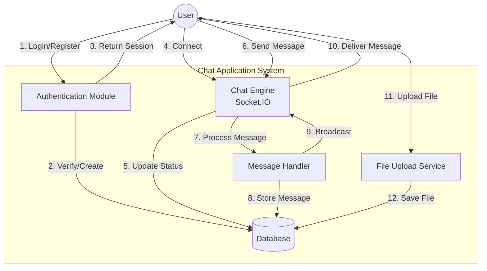
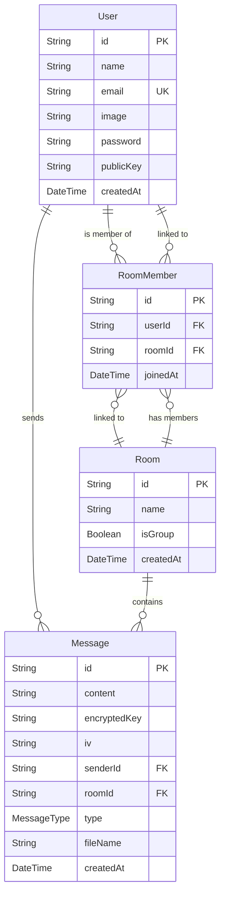

# Project Report: Secure Real-Time Chat Application

## 1. Project Overview

This project is a secure, real-time chat application designed to facilitate seamless communication between users. It features end-to-end encryption capabilities (infrastructure ready), real-time messaging using WebSockets, and a modern, responsive user interface. The system supports direct messaging (DM) and group chats, along with file sharing capabilities.

## 2. Methodology

The project follows an **Agile development methodology**, specifically adopting an iterative and incremental approach.

- **Component-Based Architecture**: The frontend is built using reusable React components (e.g., `ChatLayout`, `MessageBubble`) to ensure maintainability and scalability.
- **Separation of Concerns**: Clear separation between the client-side (Next.js) and server-side (Express.js) logic.
- **Real-Time Event Driven**: The core communication logic is event-driven, utilizing Socket.IO for instant data transfer without polling.
- **Security First**: The design incorporates encryption keys and secure authentication flows from the ground up.

## 3. System Architecture

The system is built using a **Monorepo-style structure** (logically separated) with a distinct Frontend and Backend.

- **Frontend**: Next.js (React framework) for the UI and Authentication handling.
- **Backend**: Node.js with Express for the REST API and Socket.IO for real-time communication.
- **Database**: PostgreSQL managed via Prisma ORM.

### Architecture Diagram

## 4. Backend Implementation

The backend is a robust Node.js application using TypeScript.

### Technologies

- **Runtime**: Node.js
- **Framework**: Express.js
- **Language**: TypeScript
- **Real-time Engine**: Socket.IO
- **ORM**: Prisma
- **Database**: PostgreSQL

### Key Components

1.  **Server Entry (`server.ts`)**:
    - Initializes the Express app and HTTP server.
    - Sets up Socket.IO with CORS configurations.
    - Manages online user states using a `Map<UserId, SocketId>`.
2.  **API Routes (`routes.ts`)**:
    - `POST /api/auth/register`: Creates new users with hashed passwords (bcrypt).
    - `POST /api/auth/login`: Validates credentials.
    - `GET /api/user`: Fetches user details.
    - `POST /api/rooms`: Creates or retrieves chat rooms.
    - `POST /api/upload`: Handles file uploads using `Multer`.
3.  **Socket Events**:
    - `join-room`: Subscribes a socket to a specific room channel.
    - `send-message`: Receives a message, saves it to the DB via Prisma, and broadcasts it to the room.
    - `user-online`/`disconnect`: Tracks user presence.

## 5. Frontend Implementation

The frontend is a modern web application built with Next.js 16.

### Technologies

- **Framework**: Next.js (App Router)
- **UI Library**: React 19
- **Styling**: Tailwind CSS
- **Icons**: Lucide React
- **Authentication**: NextAuth.js (Custom Credentials Provider)

### Key Components

1.  **Authentication (`lib/auth.ts`)**:
    - Uses `CredentialsProvider` to authenticate against the backend API.
    - Manages user sessions using JWT strategies.
2.  **Layouts (`ChatLayout`)**:
    - Main wrapper that handles the responsive sidebar and chat window structure.
3.  **Real-time Integration**:
    - initializes a Socket.IO client connection on mount.
    - Listens for incoming messages and updates the UI state in real-time.

## 6. Data Flow Diagrams

### DFD Level 0 (Context Diagram)

### DFD Level 1

## 7. Entity Relationship (ER) Diagram

Based on the Prisma Schema, the database structure is as follows:

## 8. System Workflow (Detailed)

This diagram illustrates the flow of a user logging in and sending a message.

